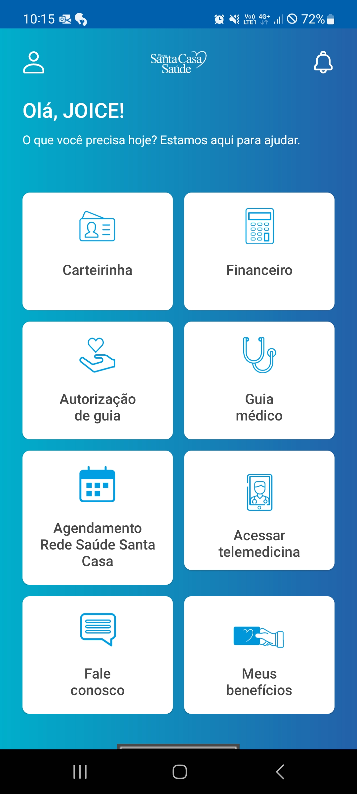
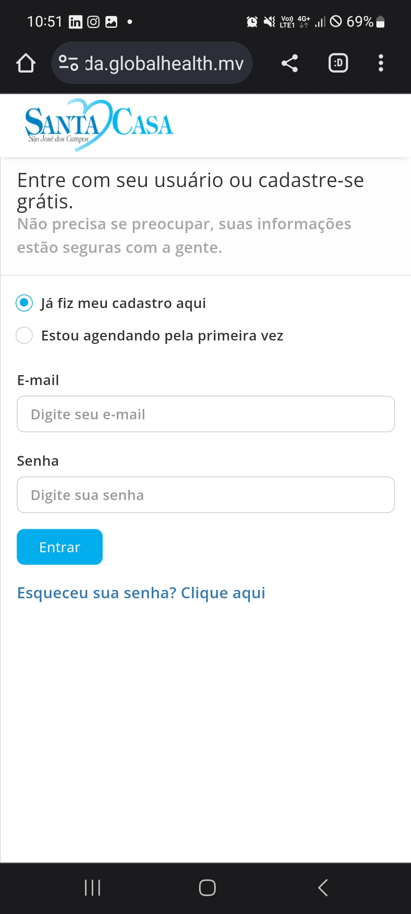
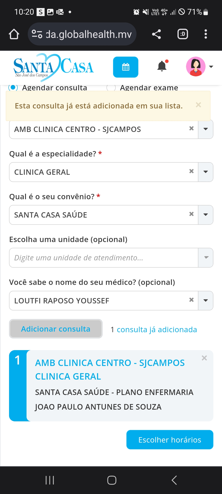

<h1>IHC Clássica</h1>

<h3> O seguinte repositório tem como objetivo avaliar de forma heurística app e sites, baseando-se nas <a href="https://www.alura.com.br/artigos/10-heuristicas-de-nielsen-uma-formula-pra-evitar-erros-basicos-de-usabilidade">10 heurísticas de Nielsen. </a></h3>

<h4> 1. Visibilidade de qual estado estamos no sistema</h4>
<h4>2. Correspondência entre o sistema e o mundo real</h4>
<h4>3. Liberdade de controle fácil pro usuáriol</h4>
<h4>4. Consistência e padrões</h4>
<h4>5. Prevenções de erros</h4>
<h4>6. Reconhecimento em vez de memorização</h4>
<h4>7. Flexibilidade e eficiência de uso</h4>
<h4>8. Estética e design minimalista</h4>
<h4>9. Ajude os usuários a reconhecerem, diagnosticarem e recuperarem-se de erros</h4>
<h4>10. Ajuda e documentação</h4>

Heurística 3

No vídeo abaixo temos o app BibliON, onde ao ir em pesquisar temos a opção de listas de livros feitas por usuários, ao escolher uma das listas e visualizar, o usuário ao voltar não volta para as listas e sim para a página de pesquisa.  

 

/img/BibliON.gif?raw=true)
 

Heusriatica 3,6,7

 O app da Santa Casa, para agendar uma consulta não é feito no próprio app(Imagem 1), é aberto o navegador onde o usuário é obrigado a logar para agendar uma consulta(Imagem 2), para agendar a consulta depois de preencher os campos, se o usuário não tem um médico em mente, ele precisa escolher um médico adicionar uma consulta pra ver a disponibilidade dos horários (Imagem 3), se não se adequar com sua agenda é preciso voltar excluir a consulta para escolher outro médico e ver os horários disponíveis de outro médico(Imagem 5).

  
 <figure>
    

<figcaption>Imagem 1</figcaption> 

</figure>
 <figure>
    

<figcaption>Imagem 2</figcaption> 

</figure>
 <figure>
    

<figcaption>Imagem 3</figcaption> 

</figure>
 <figure>
    

<figcaption>Imagem 4</figcaption> 

</figure>

Heusriatica 1

No print abaixo podemos ver o carregamento de um boleto dos correios para baixar, não é dado nenhuma estimativa de tempo, no final, não foi possivel gerar o pdf do boleto nem copiar o código de barras.

 <figure>
    

<figcaption>Imagem 4</figcaption> 

</figure>

Heusriatica 2

Na print abaixo temos a entrega de trabalho, onde os azuis correspondem a trabalhos que posem ser entregues, quando entregues a unica coisa que indica essa mudança é o status, sua cor não muda, seguindo a lógica poderia ficar amarelo, já que as outras cores correspondem a status que já estamos acostumados 

<figure>
    

<figcaption>Imagem 4</figcaption> 

</figure>

    

